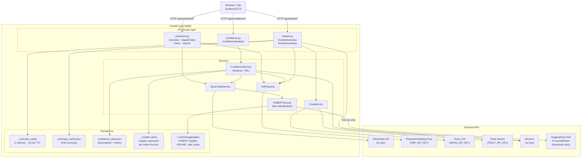
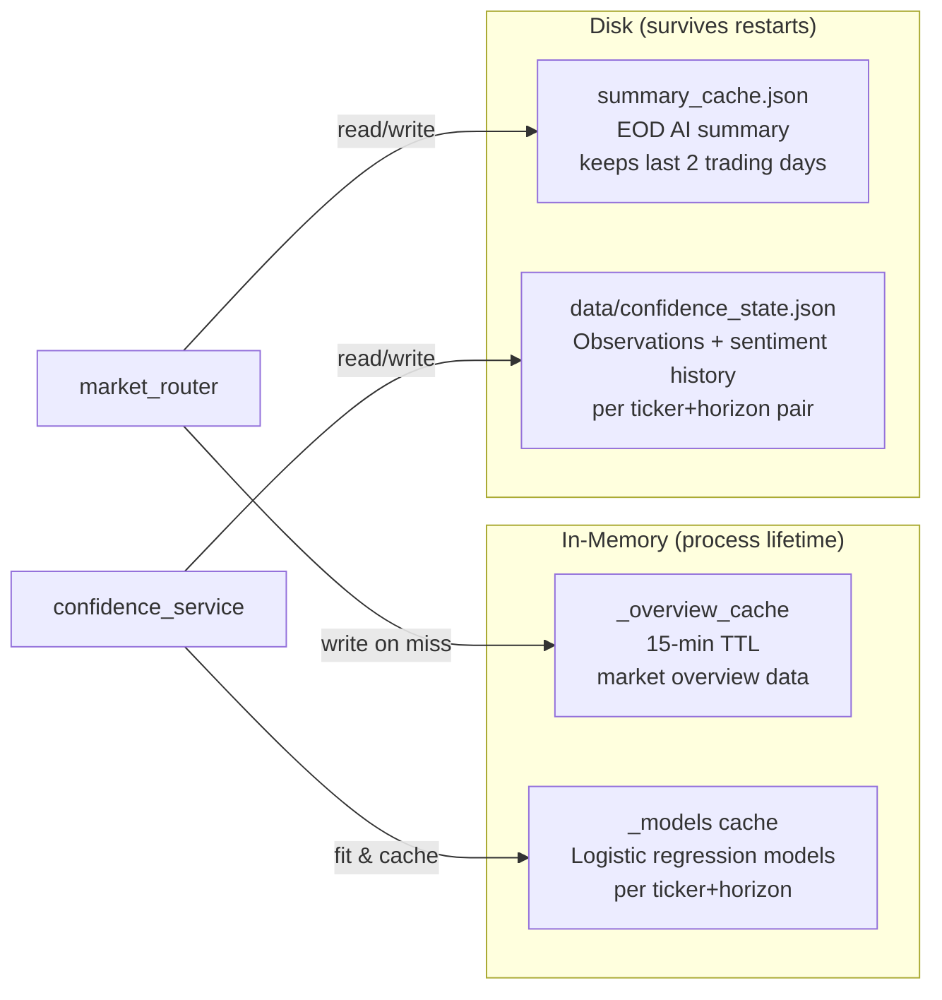
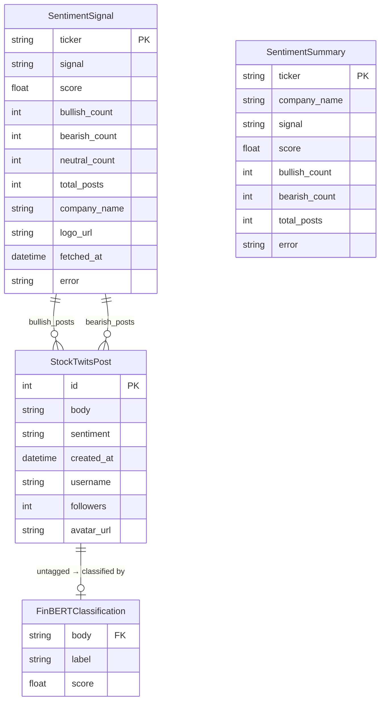
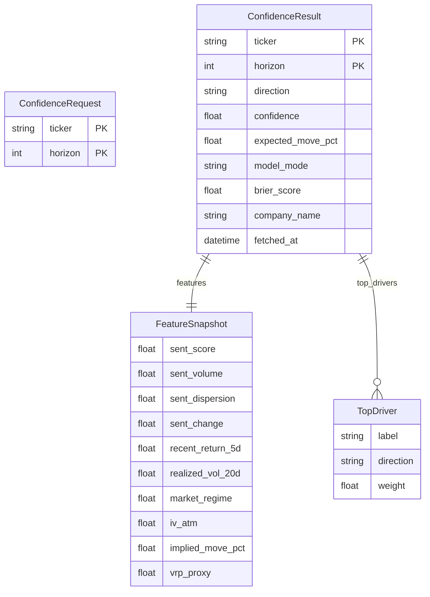
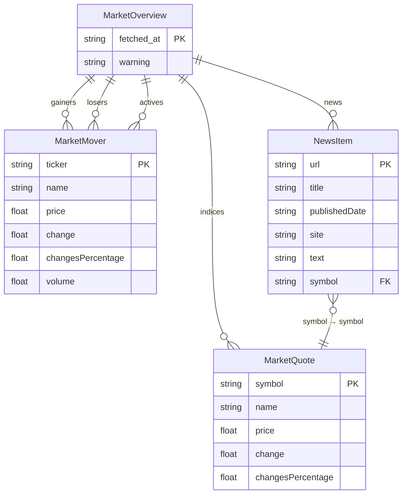
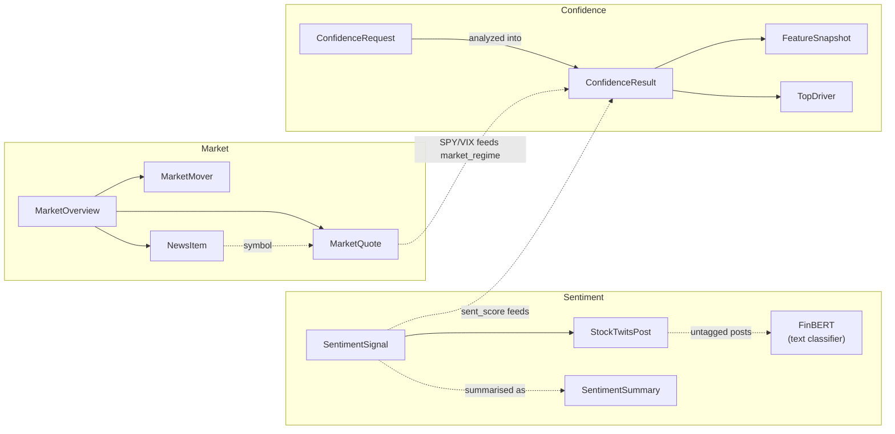
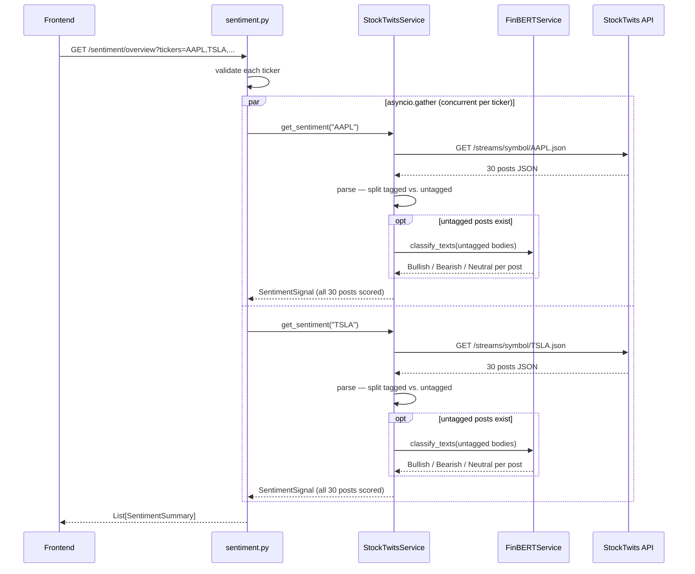
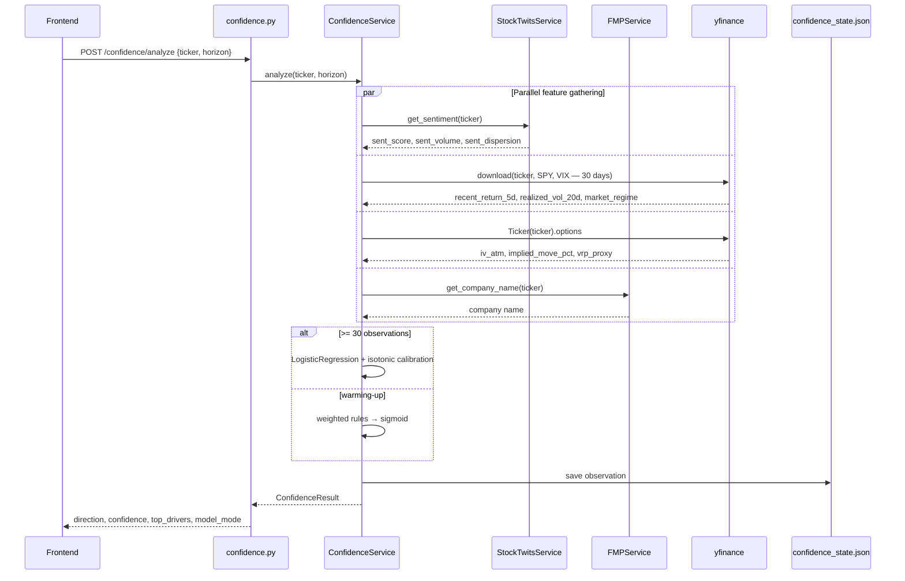
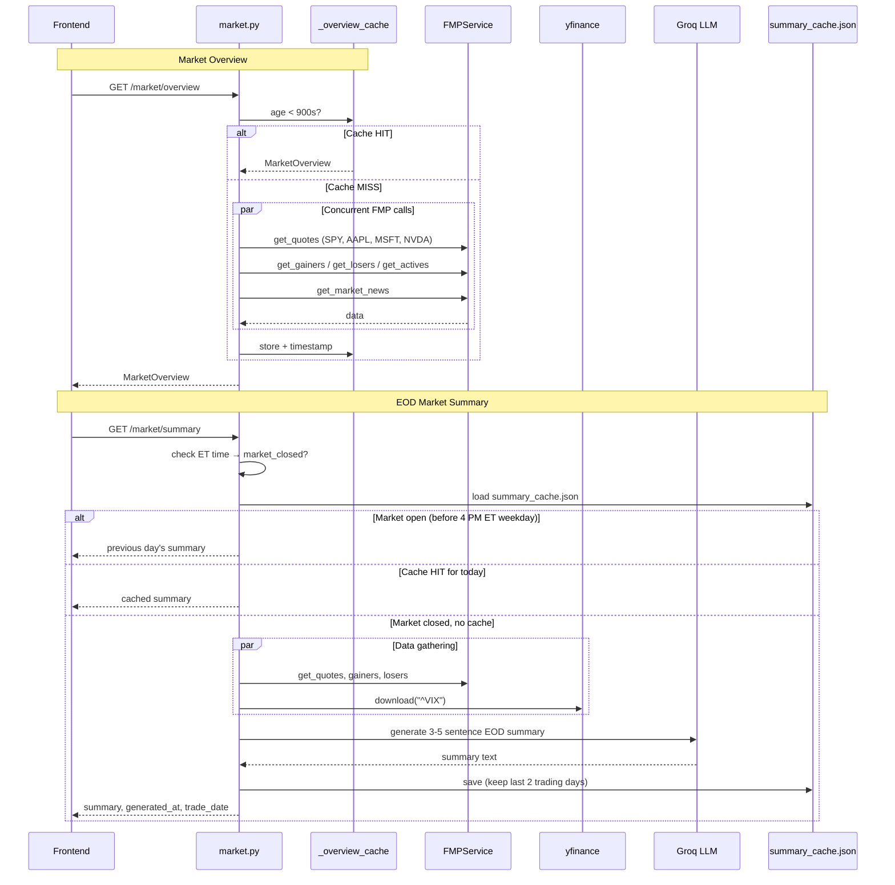

# Sentiviz — Architecture

> Diagrams rendered with [Mermaid](https://mermaid.js.org/). Open in GitHub, VS Code (Mermaid Preview), or https://mermaid.live

---

## 1. Component Overview

---

## 2. Persistence Layer

---

## 3. Data Model ERD

> These are Pydantic response models, not SQL tables. `PK` marks the natural identifier; `FK` marks a reference to another model.

### 3.1 Entity-Relationship Overview

1. **Sentiment**: `StockTwitsPost`, `SentimentSignal`, `SentimentSummary`
2. **Confidence**: `ConfidenceRequest`, `ConfidenceResult`, `FeatureSnapshot`, `TopDriver`
3. **Market**: `MarketQuote`, `MarketMover`, `NewsItem`, `MarketOverview`

### Sentiment

### Confidence

### Market

### Cross-Cluster Relationships

---

## 4. Sentiment Overview Sequence

---

## 5. Confidence Analysis Sequence

---

## 6. Market Overview & EOD Summary Sequence

